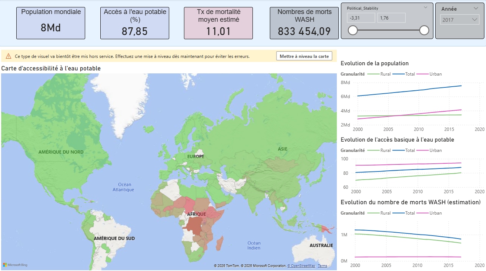
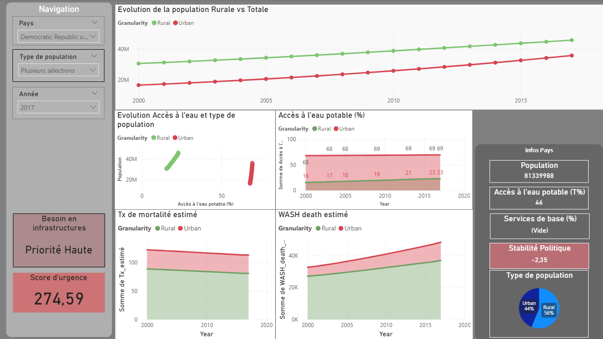

# Projet 10 : Faites une étude sur l'eau potable

## &#127919; Objectifs
* Créez des dashboards sur Power BI pour visualiser les données de l'accès à l'eau potable dans le monde pour votre ONG.

## &#128295; Outils utilisés
* **Powe Query** : Nettoyage/préparation des données
* **Power BI** : Tableaux de bords

## &#127891; Compétences acquises
* Proposer un récit des résultats dynamique pour engager un public
* Optimiser une solution de visualisation accessible, adaptée au public et au type de donnée
* Créer un tableau de bord interactif pour rendre la visualisation disponible et accessible

## Illustrations

