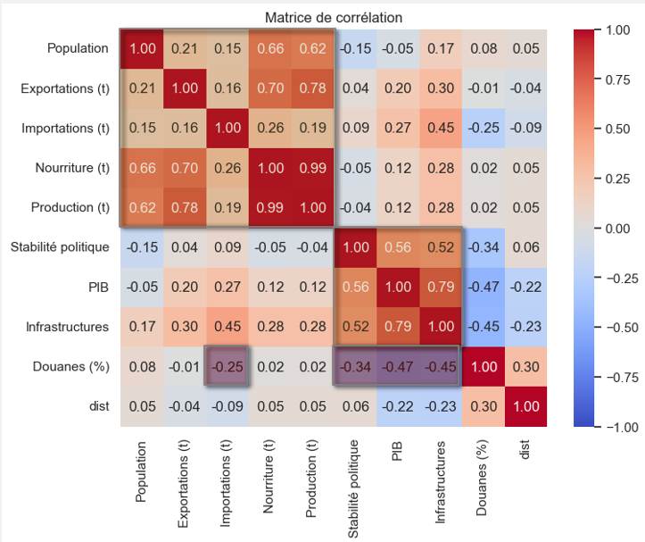
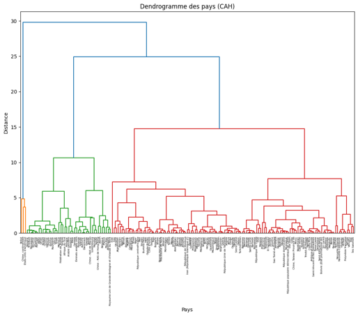
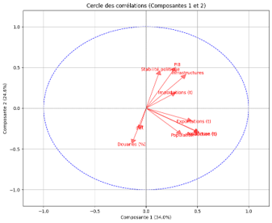
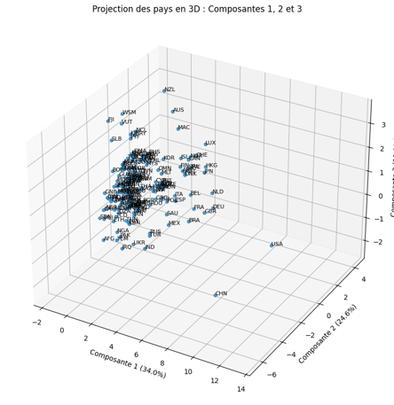
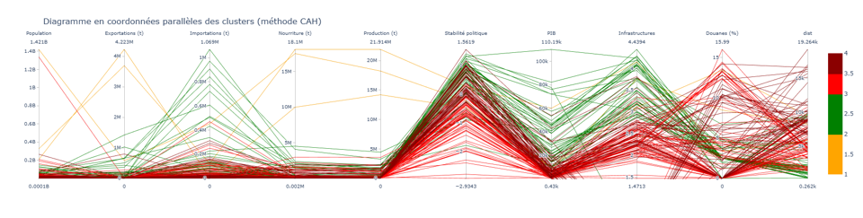

# Projet 11 : Produisez une étude de marché avec R ou Python

## &#127919; Objectifs
* Etudiez le marché de votre entreprise grâce à du clustering et une ACP pour faire des recommandations stratégiques.

## &#128295; Outils utilisés
* **jupyter notebook** : Nettoyage/préparation des données
* Pandas : importation, préparation et vérification des données.
* Pandas et Matplolib/seaborn : réalisation des analyses et visualisations.implémentation de la base et requêtes.
* Numpy :  moteur de calcul numérique de Python 
* scipy.stats : scientific computing package for python (shapiro, kruskal, spearmanr, pearsonr, chi2_contingency)
* scikit : post hoc tests
* Statsmodels : bibliothèque d'analyse et de modélisation de données statistiques
* sklearn : Standarscaler, PCA

## &#127891; Compétences acquises
* Sélectionner les variables pertinentes d'un modèle d'apprentissage
* Réduire la dimension du jeu de données pour optimiser le temps d'apprentissage des modèles
* Réaliser des analyses multivariées pour comprendre la corrélation entre les variables
* Exploiter un modèle d'apprentissage afin d'en apprendre davantage sur les données

## Illustrations

