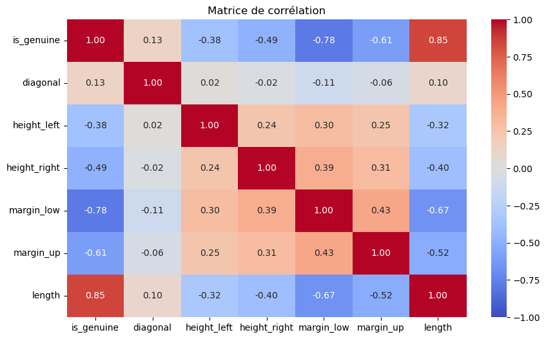
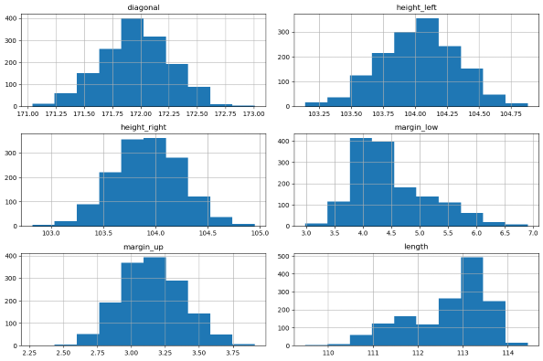
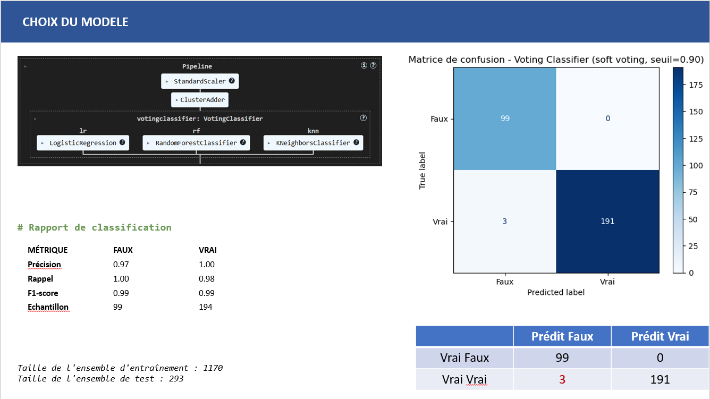
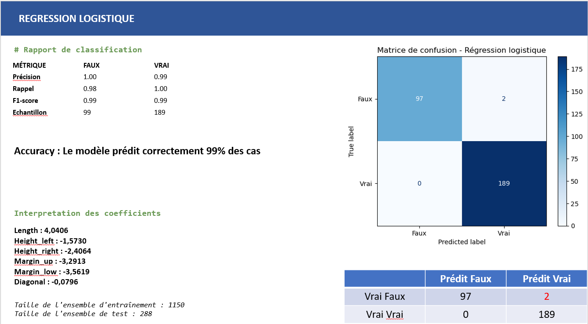

# Projet 12 : Détectez des faux billets avec R ou Python

## &#127919; Objectifs
* Construisez un modèle de prédiction pour détecter des faux billets grâce à duclustering et de la régression logistique avec R ou Python.

## &#128295; Outils utilisés 
* **jupyter notebook** : Nettoyage/préparation des données
* Pandas : importation, préparation et vérification des données.
* Pandas et Matplolib/seaborn : réalisation des analyses et visualisations.implémentation de la base et requêtes.
* Numpy :  moteur de calcul numérique de Python 
* Statsmodels : bibliothèque d'analyse et de modélisation de données statistiques
* sklearn : KNeighborsClassifier, LogisticRegression, RandomForestClassifier, GridSearchCV, KMeans

## &#127891; Compétences acquises
* Utiliser un modèle d'apprentissage supervisé pour réaliser une prédiction d'un phénomène
* Entraîner un modèle d'apprentissage non supervisé pour exploiter le modèle

## Illustrations

