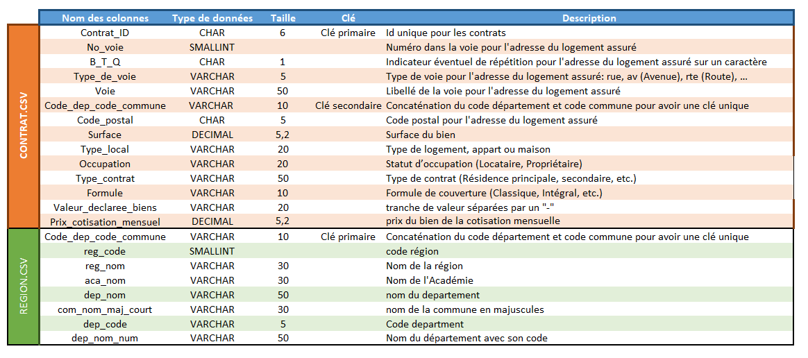
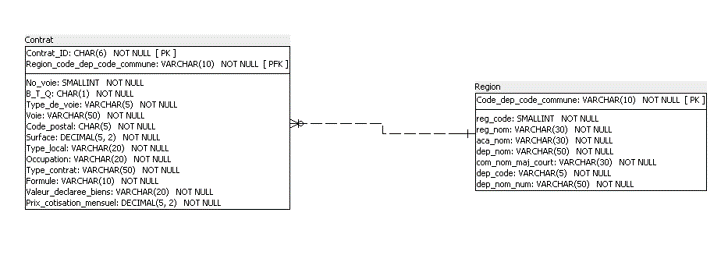
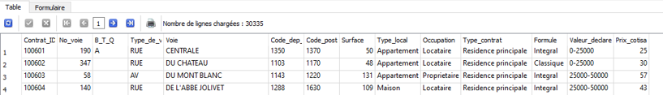
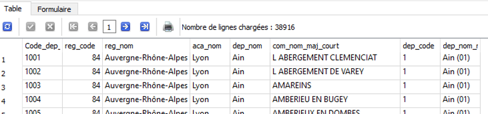

# Projet 3 : Requêtez une base de données avec SQL

## &#127919; Objectifs
* Aidez une entreprise de l'assurance à mieux accompagner ses clients en analysant le marché des assurances habitation

## &#128295; Outils utilisés
* **SQL Power Architect** : modèle relationnel des données.
* **SQLiteStudio** : implémentation de la base et requêtes.

## &#127891; Compétences acquises
* Charger des données dans une base de données
* Créer un schéma d'une base de données
* Rédiger des scripts simples en SQL pour aider à la prise de décision business

## Dictionnaire des données

## Schéma relationnel des données

## Base de données implémentée dans SQLiteStudio

