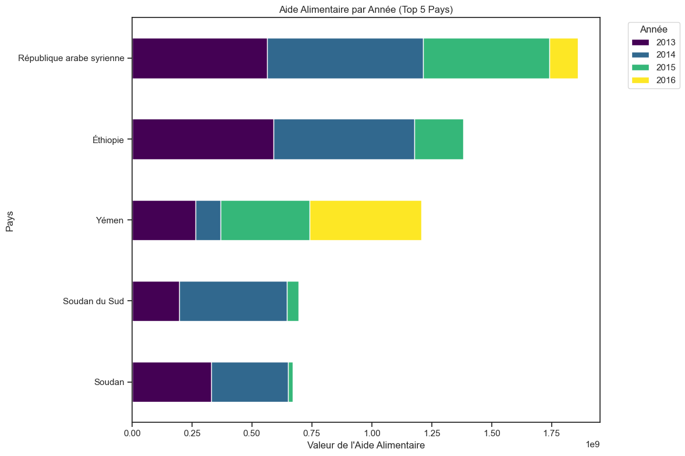
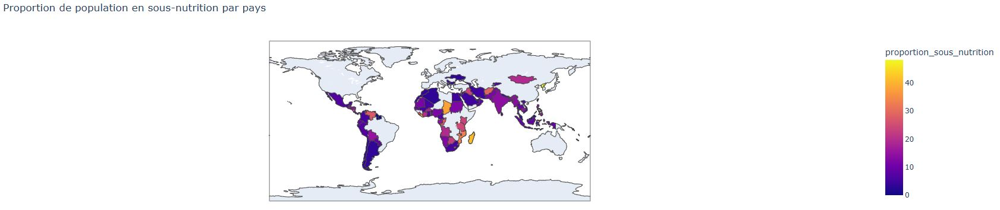
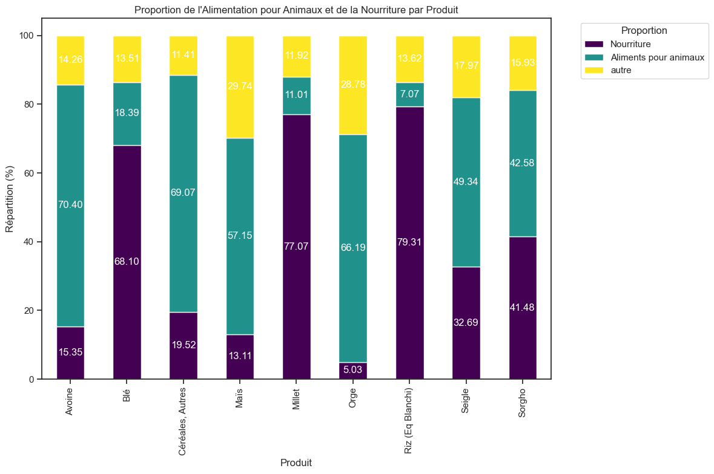
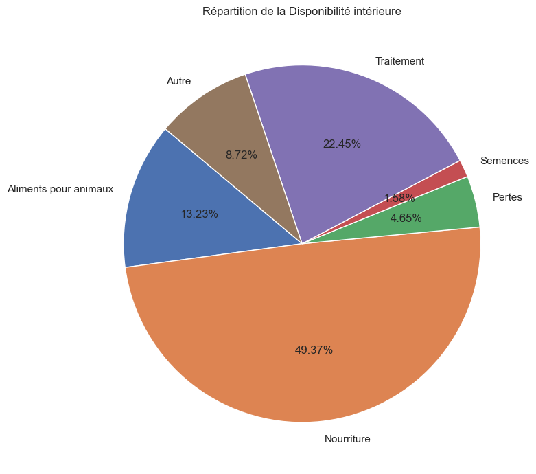

# Projet 4 : Réalisez une étude de santé publique avec R ou Python

## &#127919; Objectifs
* Prenez en main Python pour analyser les données de la FAO sur la faim dans le monde

## &#128295; Outils utilisés
* **Power Query** : préparation des données.
* **Visual studio Code**
* Pandas : importation, préparation et vérification des données.
* Pandas et Matplolib : réalisation des analyses et visualisations.implémentation de la base et requêtes.

## &#127891; Compétences acquises
* Rédiger et présenter une méthodologie d'exploration et d'analyse des données.
* Utiliser des librairies spécialisées pour les traitements data.
* Manipuler des DataFrames.

## exemple d'analyses réalisées dans notebook

