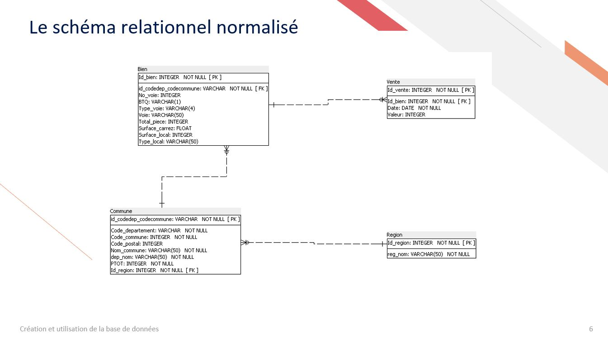
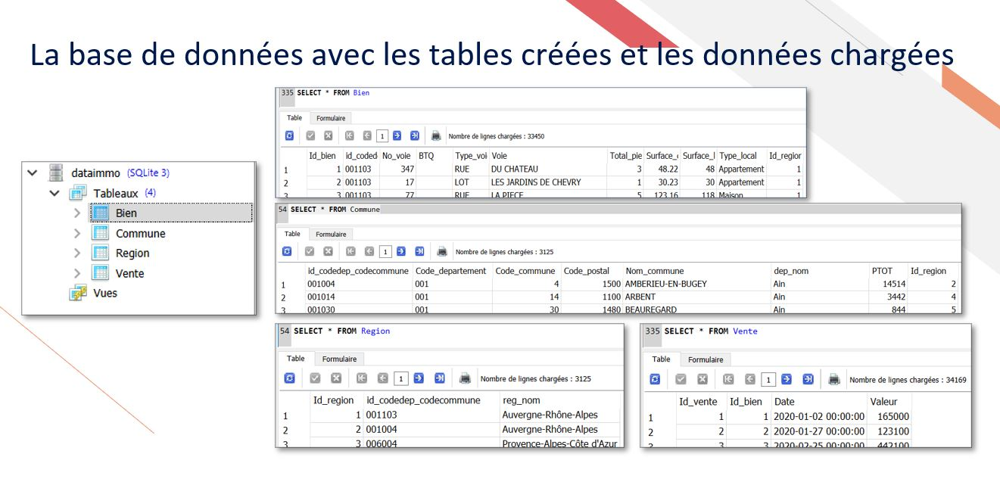
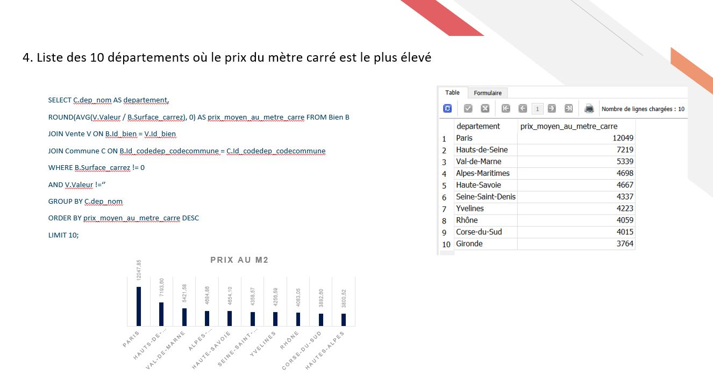

# Projet 5 : Créez et utilisez une base de données immobilière avec SQL

## &#127919; Objectifs
* À partir des données de votre agence immobilière, concevez et créez une base de données, puis faites des requêtes SQL pour extraire certaines données en respect du RGPD

## &#128295; Outils utilisés
* Power Query : préparation des données.
* SQL Power Architect : modèle relationnel des données.
 *SQLiteStudio : implémentation de la base et requêtes

## &#127891; Compétences acquises
* Effectuer des requêtes SQL pour répondre à une problématique métier en respect du RGPD
* Gérer une base de données établissant des requêtes et en respect du RGPD
* Créer une base de données en respect des normes réglementaires et des besoins clients

## Illustrations

## Exemple de requête

