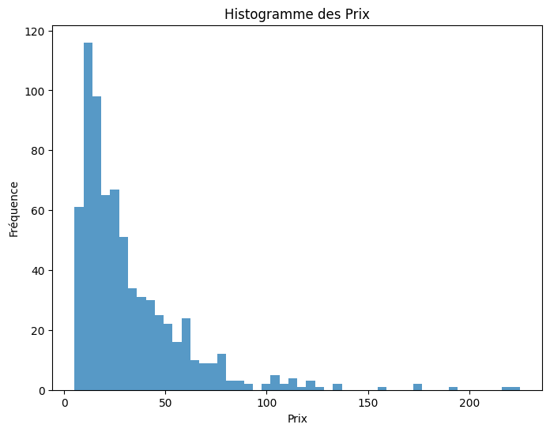
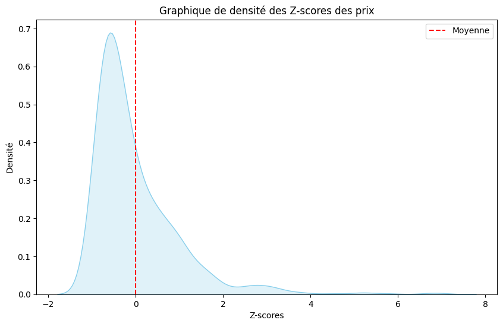
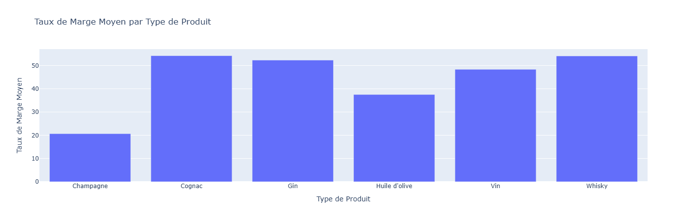

# Projet 6 : Optimisez la gestion des données d'une boutique avec R ou Python

## &#127919; Objectifs
* Les données de cette entreprise sont mal organisées. Faites cohabiter les différents jeux de données pour effectuer l'analyse demandée

## &#128295; Outils utilisés
* **Visual studio Code**
* Pandas : importation, préparation et vérification des données.
* Pandas et Matplolib/seaborn : réalisation des analyses et visualisations.implémentation de la base et requêtes.
* Numpy :  moteur de calcul numérique de Python 

## &#127891; Compétences acquises
* Effectuer des analyses univariées et multivariées des données pré-traitées
* Pré-traiter des données pour explorer et comprendre leurs caractéristiques
* Traiter, nettoyer des données et définir la gestion des incohérences en conformité du RGPD

## exemple d'analyses réalisées dans notebook

