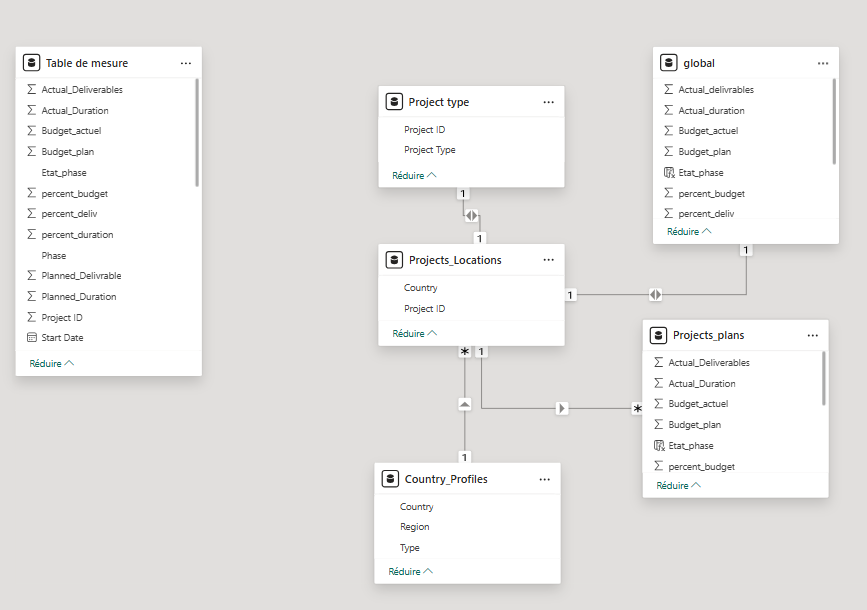
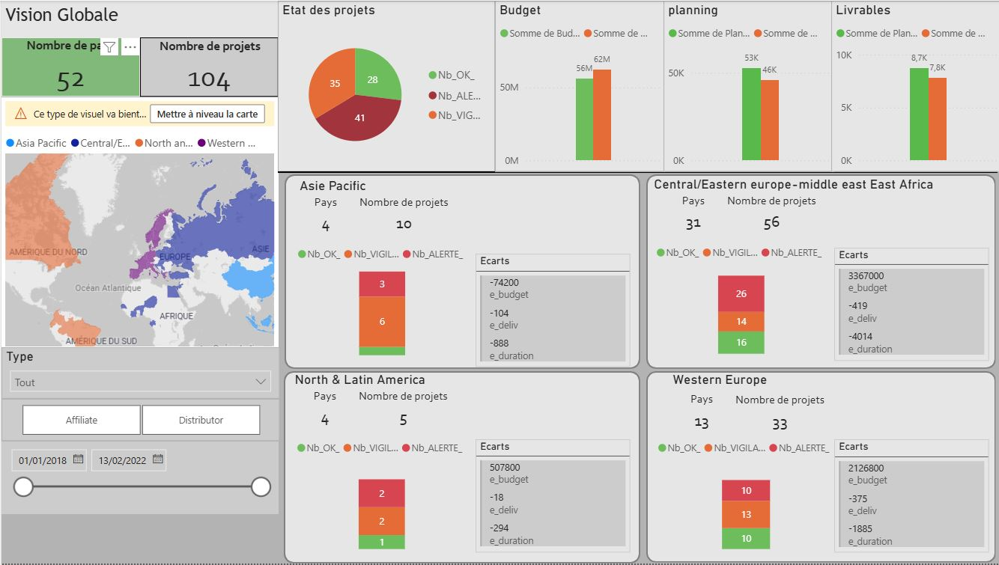
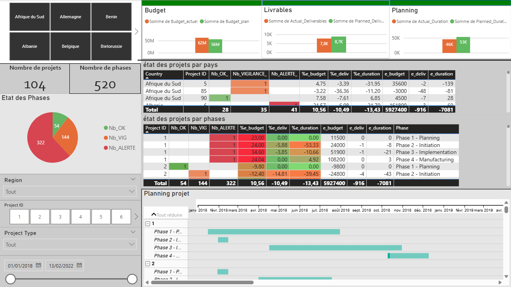

# Projet 7 : Créez un tableau de bord dynamique avec Power BI pour visualiser l'avancement de projets

## &#127919; Objectifs
* Aidez une entreprise à développer un outil de suivi pour faciliter leur gestion de projet et identifier les retards

## &#128295; Outils utilisés
* **Power Query** : nettoyage des données
* **Power BI** : Tableaux de bords

## &#127891; Compétences acquises
* Produire un reporting en analysant les visualisations pour faciliter les décisions

## Illustrations

