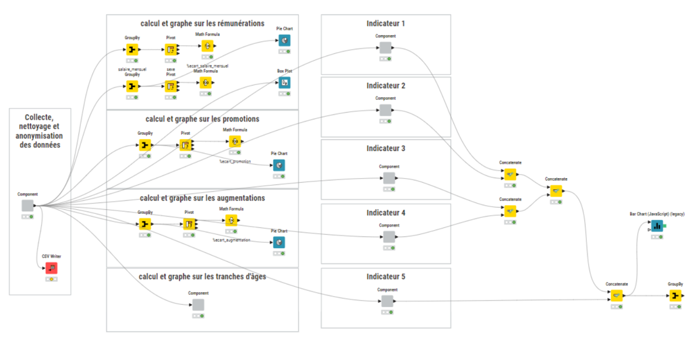
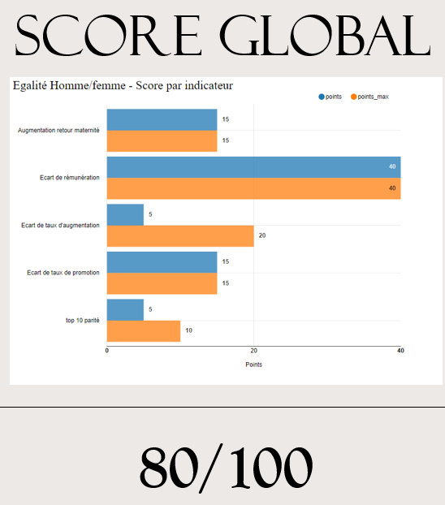

# Projet 8 : Analysez des indicateurs de l'égalité femmes/hommes en respect du RGPD

## &#127919; Objectifs
* Collectez les données des collaborateurs de votre entreprise en respectant le RGPD. Puis tirez-en les indicateurs de l'égalité homme-femme

## &#128295; Outils utilisés
* **Knime** : KNIME est un outil d'analyse et de science des données qui vous permet de créer des flux de données de toute complexité grâce à une programmation par glisser-déposer très accessible et sans code.

## &#127891; Compétences acquises
* Collecter des données pertinentes en respect des normes et bonnes pratiques
* Vérifier la cohérence et la fiabilité des données préparées
* Agréger des extractions de données en définissant les règles de nettoyage

## Illustrations

