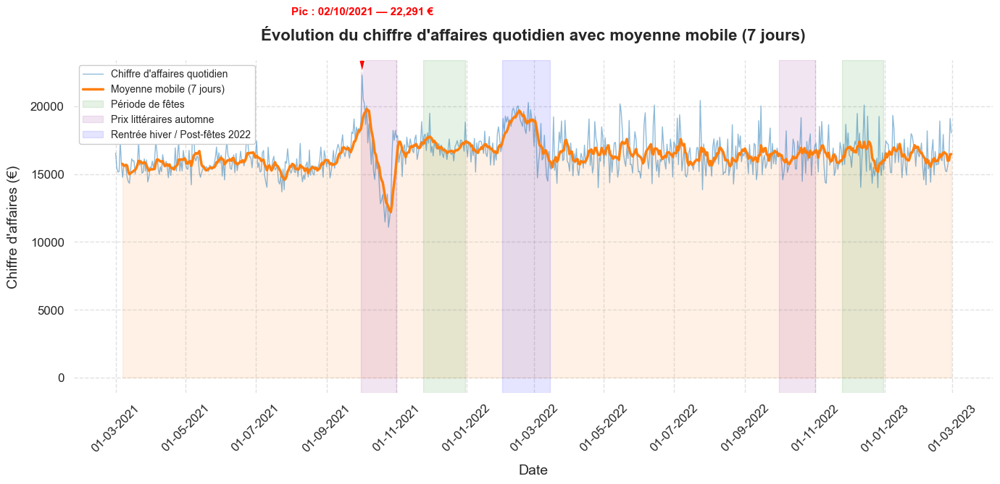
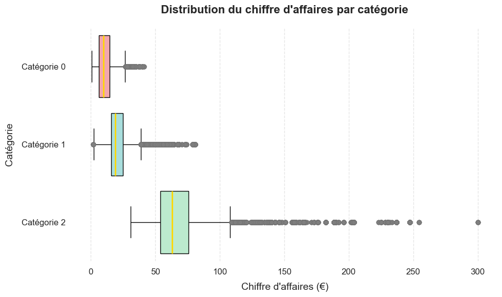
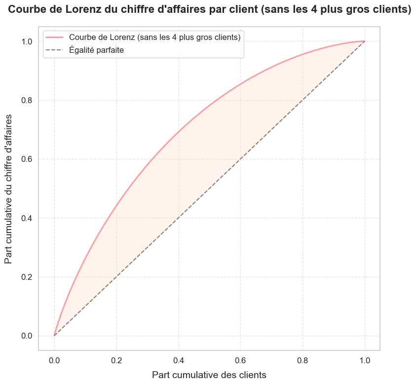
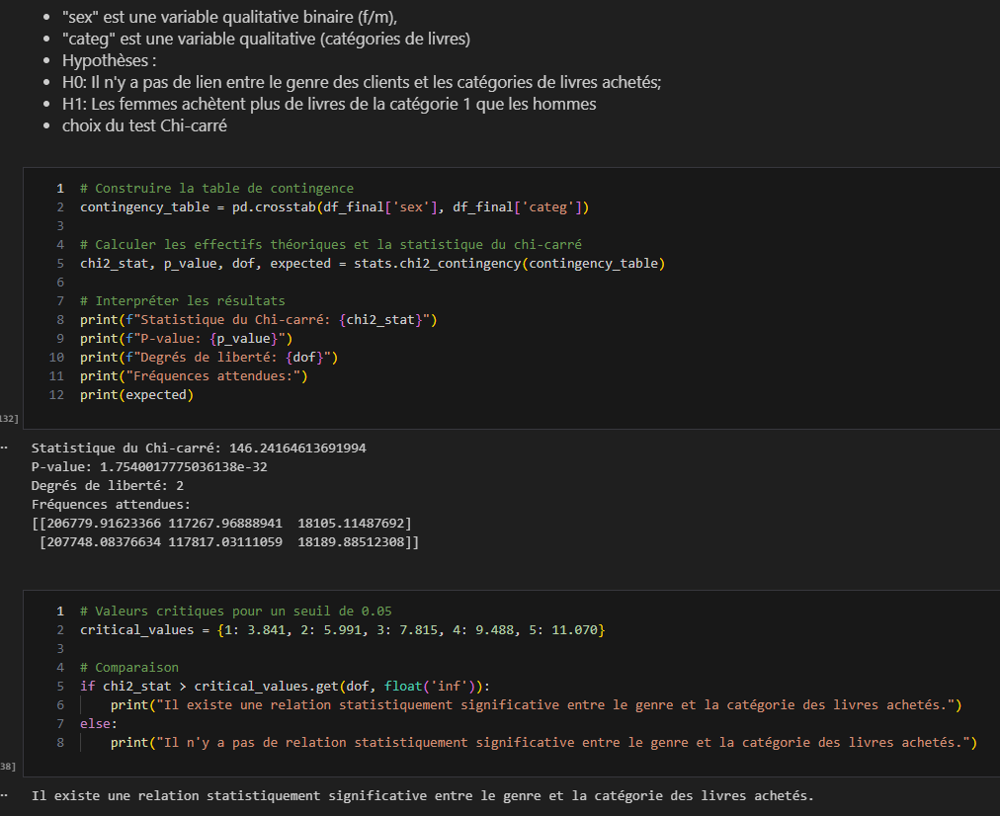

# Projet 9 : Analysez les ventes d'une librairie avec R ou Python

## &#127919; Objectifs
* Vous avez accès à toutes les données de vente de votre client, une librairie.
* Répondez à leurs demandes en analysant les comportements d'achats et en réalisant une prévision des ventes.

## &#128295; Outils utilisés
* **Visual studio Code**
* Pandas : importation, préparation et vérification des données.
* Pandas et Matplolib/seaborn : réalisation des analyses et visualisations.implémentation de la base et requêtes.
* Numpy :  moteur de calcul numérique de Python 
* scipy.stats : scientific computing package for python (shapiro, kruskal, spearmanr, pearsonr, chi2_contingency)
* scikit : post hoc tests
* Statsmodels : bibliothèque d'analyse et de modélisation de données statistiques

## &#127891; Compétences acquises
* Analyser un jeu de données avec séries temporelles pour mesurer un phénomène statistique
* Réaliser des tests statistiques sur des données afin de tester et valider des hypothèses

## Illustrations

